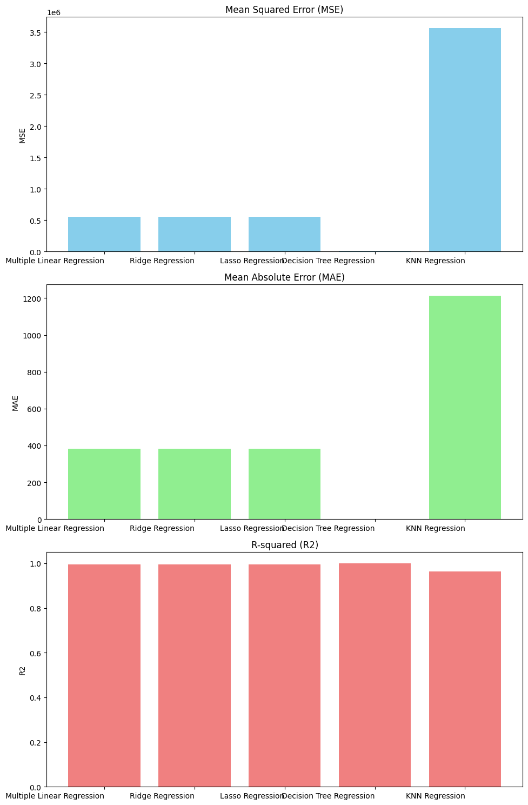
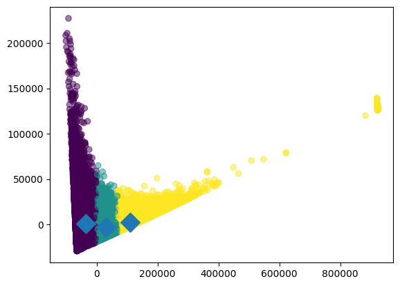

# Supervised Learning
## Decision Tree Regression

From the image above it can be seen that the decision tree algorithm has almost perfect results on evaluation metrics of regression.

After the results of the hyperparameter optimization, the new R-squared value is exceptionally high. 
Best Parameters found by Random Search:
 min_samples_split: 7
 min_samples_leaf: 2
 max_depth: 10

Best Score achieved: 0.9999

# Unsupervised Learning
## K-Means Clustering
As can be seen on the graph the clusters are somewhat well-defined and centroids are visible and separate.

The silhouette score which is the used evaluation metric for the K-means clustering is 0.5579113195179776, which in retrospect is an acceptable score.

# Comparison Of Models
- Overall both models are working well, yet the decision tree model has significantly better scores on its respective evaluation metrics.

# Kaggle Notebook Link
https://www.kaggle.com/code/sudesahinn/vechicle-sales-project

# References
https://stackabuse.com/kernel-density-estimation-in-python-using-scikit-learn/
https://medium.com/@weidagang/essential-math-for-machine-learning-kernel-density-estimation-d014df073770#:~:text=Kernel%20Density%20Estimation%20(KDE)%20is,underlying%20distribution%20for%20the%20data.
https://scikit-learn.org/dev/modules/generated/sklearn.neighbors.KernelDensity.html
https://medium.com/analytics-vidhya/appropriate-ways-to-treat-missing-values-f82f00edd9be
https://scikit-learn.org/stable/modules/impute.html
https://www.freecodecamp.org/news/how-to-use-markdown-in-vscode/
https://www.kaggle.com/datasets/syedanwarafridi/vehicle-sales-data
https://www.kaggle.com/code/alirezahasannejad/data-preprocessing-in-machine-learning
https://medium.com/womenintechnology/data-preprocessing-steps-for-machine-learning-in-phyton-part-1-18009c6f1153
https://medium.com/operations-management-t%C3%BCrkiye/label-encoder-ve-onehotencoder-kar%C5%9F%C4%B1la%C5%9Ft%C4%B1rmas%C4%B1-c0983e884fc5
https://www.analyticsvidhya.com/blog/2020/03/one-hot-encoding-vs-label-encoding-using-scikit-learn/
https://medium.com/@noorfatimaafzalbutt/handling-missing-categorical-data-in-pandas-and-sklearn-0740b8ea64c8
https://scikit-learn.org/dev/modules/density.html#kernel-density
https://medium.com/aiskunks/imputation-techniques-for-numerical-features-1331d427fff1
https://www.geeksforgeeks.org/k-means-clustering-introduction/#implementation-of-kmeans-clustering-in-python
https://www.w3schools.com/python/python_ml_k-means.asp
https://www.kaggle.com/code/prashant111/k-means-clustering-with-python
https://medium.com/@nirmalsankalana/k-means-clustering-choosing-optimal-k-process-and-evaluation-methods-2c69377a7ee4
https://www.altexsoft.com/blog/unsupervised-machine-learning/
https://www.geeksforgeeks.org/how-to-tune-a-decision-tree-in-hyperparameter-tuning/
https://www.geeksforgeeks.org/comparing-randomized-search-and-grid-search-for-hyperparameter-estimation-in-scikit-learn/
https://medium.com/@brandon93.w/regression-model-evaluation-metrics-r-squared-adjusted-r-squared-mse-rmse-and-mae-24dcc0e4cbd3
https://medium.com/latinxinai/evaluation-metrics-for-regression-models-03f2143ecec2
https://www.geeksforgeeks.org/what-is-ridge-regression/
https://thedatascientist.com/supervised-learning-machine-learning-tutorial/
https://medium.com/@shuv.sdr/multiple-linear-regression-in-python-4ee79d763e8f
https://www.kaggle.com/code/marcinrutecki/regression-models-evaluation-metrics
https://www.geeksforgeeks.org/k-nearest-neighbors-knn-regression-with-scikit-learn/
https://medium.com/@vk.viswa/unveiling-decision-tree-regression-exploring-its-principles-implementation-beb882d756c6
https://www.statology.org/transform-data-in-python/
https://medium.com/geekculture/feature-selection-in-machine-learning-correlation-matrix-univariate-testing-rfecv-1186168fac12
